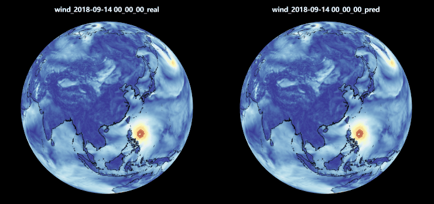
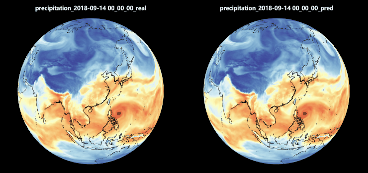

# Global Data-driven High-resolution Weather Model

简体中文 | [English](README_en.md)

本项目在幻方萤火超算集群上用 PyTorch 实现并优化了 FourCastNet 全球AI气象预报模型，首次使得AI气象模型能够与欧洲中期天气预报中心（ECMWF）的传统物理模型，高分辨率综合预测系统（IFS），进行直接比较。

台风路径预测与真实路径比较



汽水浓度预测与真实情况比较




## Requirements

- hfai
- torch >=1.8


## Training
原始数据来自欧洲中期天气预报中心（ECMWF）提供的一个公开可用的综合数据集 [ERA5](https://www.ecmwf.int/en/forecasts/datasets/reanalysis-datasets/era5) ，
幻方AI将其进行了整理，合入 `hfai.datasets` 数据集仓库中， 使用参考 [hfai文档](https://doc.hfai.high-flyer.cn/api/datasets.html#hfai.datasets.ERA5) 。

1. 预训练

   提交任务至萤火集群，使用64张A100训练
   ```shell
    hfai python train/pretrain.py -- -n 8 -p 30
   ```
   本地运行：
   ```shell
    python train/pretrain.py
   ```

2. 微调训练

   提交任务至萤火集群，在之前的预训练模型上微调
   ```shell
    hfai python train/fine_tune.py -- -n 8 -p 30
   ```
   本地运行：
   ```shell
    python train/fine_tune.py
   ```

3. 降水模型训练

   提交任务至萤火集群，以主干模型的输出作为输入，训练降水模型
   ```shell
    hfai python train/precipitation.py -- -n 8 -p 30
   ```
   本地运行：
   ```shell
    python train/precipitation.py
   ```


## Citation

```bibtex
@article{pathak2022fourcastnet,
  title={Fourcastnet: A global data-driven high-resolution weather model using adaptive fourier neural operators},
  author={Pathak, Jaideep and Subramanian, Shashank and Harrington, Peter and Raja, Sanjeev and Chattopadhyay, Ashesh and Mardani, Morteza and Kurth, Thorsten and Hall, David and Li, Zongyi and Azizzadenesheli, Kamyar and others},
  journal={arXiv preprint arXiv:2202.11214},
  year={2022}
}
```